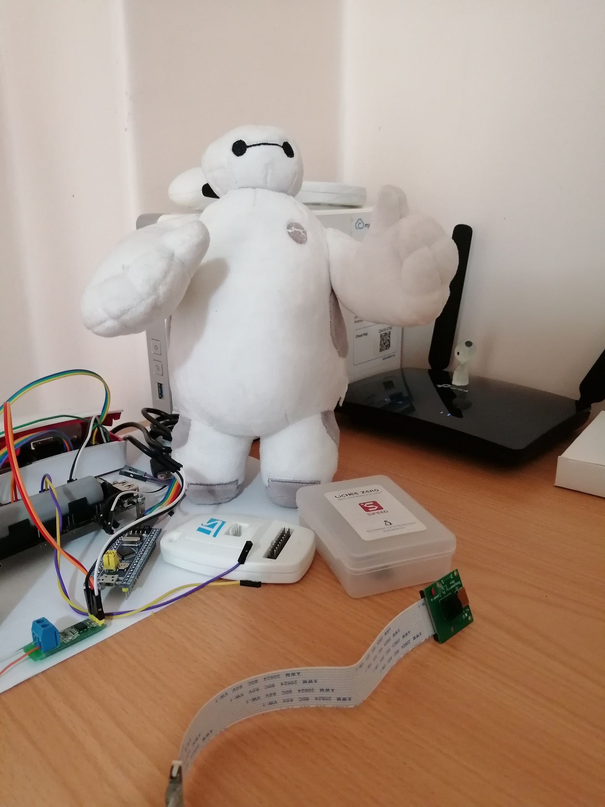

# Introduction 
This docment is about how to add Raspberry Pi camera `module v1.3` to `lichee pi zero dock` board.  
As you know, `v3s` has `mipi-csi2` interface.  
All of required drivers are developed and available in mainline Linux kernel (6.12.10).  
Also Rpi camera v1.3 (which is basd on `ov5647`) has working driver in kernel.  
So in this document, we are about to connect these two and take a tiny picture!  

- First you need to setup your [hardware](/hw.md)  
- Then [software](/sw.md) configuration and taking picture
- For more information following [resoures](/res.md) may help

# Result
Here is what I got from `Baymax` (it's `1920x1080`)  

  

From other point for view, I had it like this:  

  