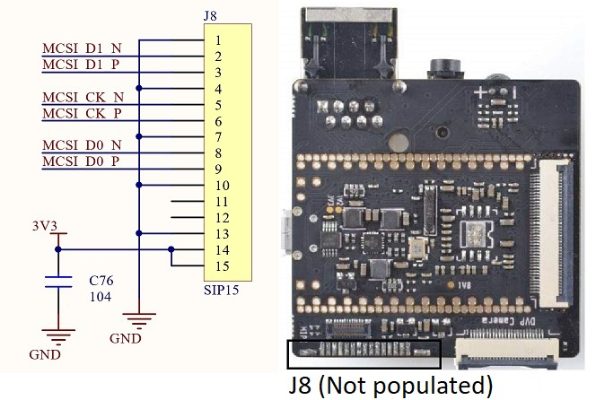
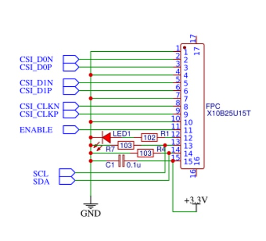
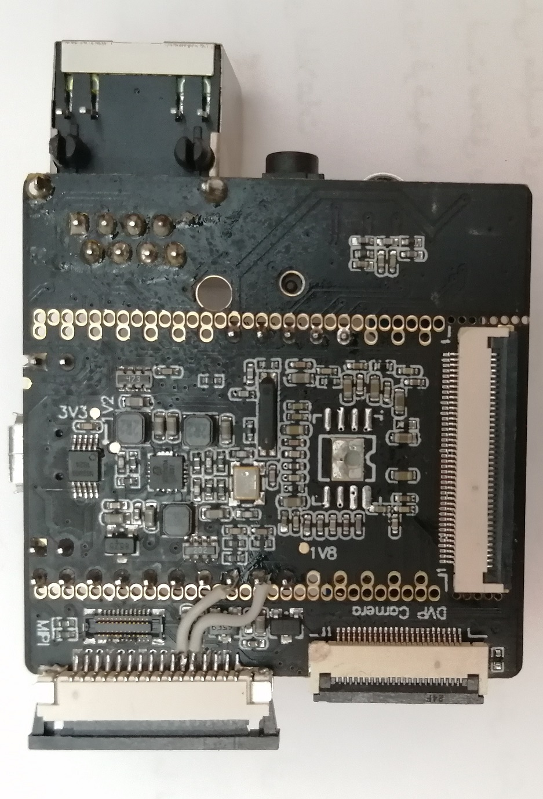
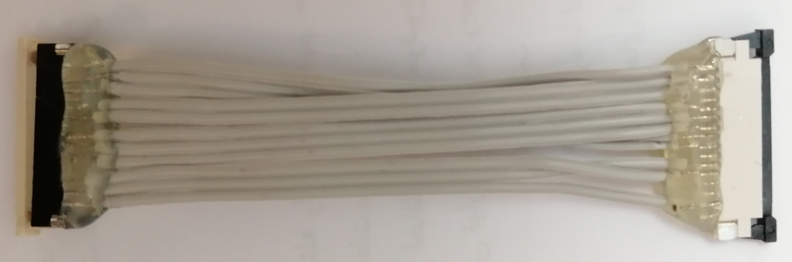
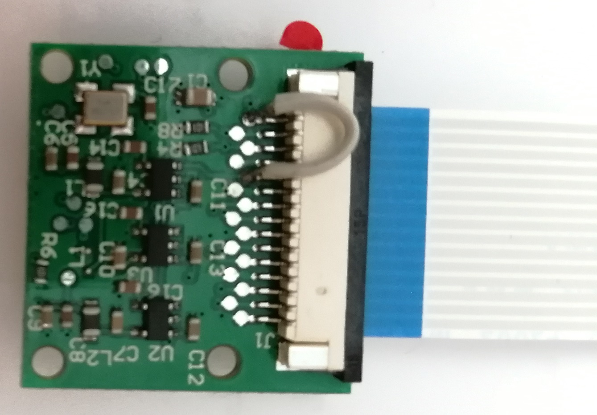

# HW
Overall hardware related steps includes 
1. Populate `J8` connector of _Lichee pi zero dock_ with `15 pin FPC, pitch 1mm`
1. Add `i2c` connection to `J8`
1. Create a addapter cable 
1. Hard wire camera `en` pin to `vdd` (It's pin `11` on flat cable)

You may be wondering where all these magics come from!  
It' just because `J8` connector pinout on `Lichee Pi Zero Dock` is not compatible with `Rpi camera`.  
More accouratly, `J8` pinout is **WRONG**.  
This is `J8` (Lichee Pi Zero Dock) pinout:

This is `Rpi camera` pinout:  

## Step 1 & 2
After _Steps 1_ and _2_, you may have someting like this.  
Those two wires connects `i2c` pins of camera module to `i2c0` of `v3s`.  
I used pin `11` and `12` of `J8` which were unused.

You may noticed that connector I used has **16 pins** :D  
Yes, you're right. I could **not** find `15 pins` flat cable. So I used 16 pin connector and falt.  

## Step 3
_Step 3_ is about creating adapter cable Which handles wrong connections of `J8`.  
It's somthing like this:  

## Step 4
_Step 4_ is about hard wiring camera enable pin (pin `11`) to `vdd`.  
I did it because there was no free pin left on `J8` (And I messed up with `pin 16` too!)  
Just keep it simple!

Ok ...  
Now were are ready for software part!