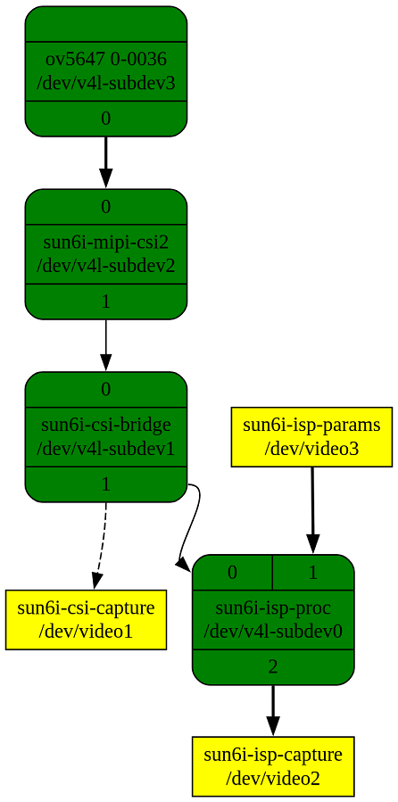
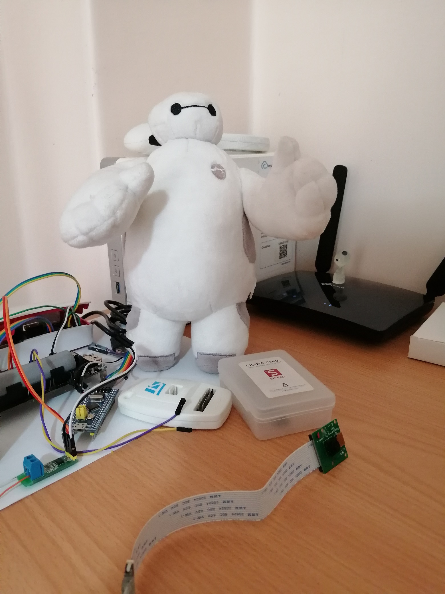

# SW
I'm using Linux kernel `6.12.10` from __kernel.org__.  
Over all steps in SW part includes:
1. Configure kernel with `sunxi_defconfig` and use `sun8i-v3s-licheepi-zero-dock.dtb`
2. Enable required kernel modules (`ov5647`, `mipi-dphy`, `csi`, ...)
3. Modify `sun8i-v3s-licheepi-zero-dock.dts` to describe component connections
4. Deploy `dtb`, `uImage`, `modules` into board
5. Check media pipeline is created and sub devices are working
6. Configure pipeline with `media-ctl`
7. Configure camera sensor for proper gain and exposure
8. Take tiny picture with `v4l2-ctl`

## Step 2
In _Step 2_, you need to active following modules (builtin or module)
1. [Allwinner A31 Camera Sensor Interface](https://elixir.bootlin.com/linux/v6.12.10/source/Documentation/devicetree/bindings/media/allwinner,sun6i-a31-csi.yaml)
1. [Allwinner A31 MIPI CSI-2 controller](https://elixir.bootlin.com/linux/v6.12.10/source/Documentation/devicetree/bindings/media/allwinner,sun6i-a31-mipi-csi2.yaml)
1. [Allwinner A31 MIPI D-PHY Controller](https://elixir.bootlin.com/linux/v6.12.10/source/Documentation/devicetree/bindings/phy/allwinner,sun6i-a31-mipi-dphy.yaml)
1. [Allwinner A31 Image Signal Processor Driver (ISP)](https://elixir.bootlin.com/linux/v6.12.10/source/Documentation/devicetree/bindings/media/allwinner,sun6i-a31-isp.yaml)
1. [Omnivision OV5647 raw image sensor](https://elixir.bootlin.com/linux/v6.12.10/source/Documentation/devicetree/bindings/media/i2c/ovti,ov5647.yaml)

## Step 3
In _Step 3_ you need to modify `sun8i-v3s-licheepi-zero-dock.dts` in order to introduce these fancy hardware connection to kernel.  
You need something like this:
```
/ {
	isp: isp@1cb8000 {
        compatible = "allwinner,sun8i-v3s-isp";
        reg = <0x01cb8000 0x1000>;
        interrupts = <GIC_SPI 83 IRQ_TYPE_LEVEL_HIGH>;
        clocks = <&ccu CLK_BUS_CSI>,
             <&ccu CLK_CSI1_SCLK>,
             <&ccu CLK_DRAM_CSI>;
        clock-names = "bus", "mod", "ram";
        resets = <&ccu RST_BUS_CSI>;
		status = "okay";

        ports {
            #address-cells = <1>;
            #size-cells = <0>;

            port@0 {
                reg = <0>;
                isp_in_csi0: endpoint {
                    remote-endpoint = <&csi0_ep2>;
                };
            };
        };
    };

	csi0: camera@1cb0000 {
		compatible = "allwinner,sun8i-v3s-csi";
		reg = <0x01cb0000 0x1000>;
		interrupts = <GIC_SPI 83 IRQ_TYPE_LEVEL_HIGH>;
		clocks = <&ccu CLK_BUS_CSI>,
				 <&ccu CLK_CSI1_SCLK>,
				 <&ccu CLK_DRAM_CSI>;
		clock-names = "bus", "mod", "ram";
		resets = <&ccu RST_BUS_CSI>;

		ports {
			#address-cells = <1>;
			#size-cells = <0>;

			port@1 {
				reg = <1>;
				csi0_in_mipi_csi2: endpoint {
					remote-endpoint = <&mipi_csi2_out_csi0>;
				};
			};

			port@2 {
				reg = <2>;
				csi0_ep2: endpoint {
					remote-endpoint = <&isp_in_csi0>;
				};
			};
		};
	};

	mipi_csi2: csi@1cb1000 {
		compatible = "allwinner,sun8i-v3s-mipi-csi2",
				     "allwinner,sun6i-a31-mipi-csi2";
		reg = <0x01cb1000 0x1000>;
		interrupts = <GIC_SPI 90 IRQ_TYPE_LEVEL_HIGH>;
		clocks = <&ccu CLK_BUS_CSI>,
				 <&ccu CLK_CSI1_SCLK>;
		clock-names = "bus", "mod";
		resets = <&ccu RST_BUS_CSI>;

		phys = <&dphy>;
		phy-names = "dphy";

		ports {
			#address-cells = <1>;
			#size-cells = <0>;

			mipi_csi2_in: port@0 {
				reg = <0>;
				mipi_csi2_in_ov5647: endpoint {
                    data-lanes = <1 2>;
                    remote-endpoint = <&ov5647_out_mipi_csi2>;
                };
			};

			mipi_csi2_out: port@1 {
				reg = <1>;
				mipi_csi2_out_csi0: endpoint {
					remote-endpoint = <&csi0_in_mipi_csi2>;
				};
			};
		};
	};

	dphy: d-phy@1cb2000 {
		compatible = "allwinner,sun6i-a31-mipi-dphy";
		reg = <0x01cb2000 0x1000>;
		clocks = <&ccu CLK_BUS_CSI>,
				 <&ccu CLK_MIPI_CSI>;
		clock-names = "bus", "mod";
		resets = <&ccu RST_BUS_CSI>;
		allwinner,direction = "rx";
		#phy-cells = <0>;
	};

	osc25M: osc25M-clk {
		#clock-cells = <0>;
		compatible = "fixed-clock";
		clock-frequency = <25000000>;
		clock-accuracy = <50000>;
		clock-output-names = "osc25M";
	};
};

&i2c0 {
	pinctrl-names = "default";
	pinctrl-0 = <&i2c0_pins>;
	status = "okay";

	ov5647: camera@36 {
        compatible = "ovti,ov5647";
        reg = <0x36>;
		clocks = <&osc25M>;

        port {
            ov5647_out_mipi_csi2: endpoint {
                    remote-endpoint = <&mipi_csi2_in_ov5647>;
            };
        };
    };
};
```

## Step 5
In _Step 5_, if everything works fine, you may have a media pipeline like this picture.  
  
This graph is created by results of `media-ctl -d /dev/media1 --print-dot` and [OnlineGraphiz](https://dreampuf.github.io/GraphvizOnline/).  
You can check your current pipe line with following commands (maybe device indexes differs for you) 
```
root@licheepizero-dock:~# media-ctl -d /dev/media1 -p
Media controller API version 6.12.10

Media device information
------------------------
driver          sun6i-isp
model           Allwinner A31 ISP Device
serial          
bus info        platform:1cb8000.isp
hw revision     0x0
driver version  6.12.10

Device topology
- entity 1: sun6i-isp-proc (3 pads, 3 links)
            type V4L2 subdev subtype Unknown flags 0
            device node name /dev/v4l-subdev0
	pad0: Sink
		[fmt:unknown/0x0]
		<- "sun6i-csi-bridge":1 [ENABLED]
	pad1: Sink
		[fmt:unknown/0x0]
		<- "sun6i-isp-params":0 [ENABLED,IMMUTABLE]
	pad2: Source
		[fmt:unknown/0x0]
		-> "sun6i-isp-capture":0 [ENABLED,IMMUTABLE]

- entity 5: sun6i-csi-bridge (2 pads, 3 links)
            type V4L2 subdev subtype Unknown flags 0
            device node name /dev/v4l-subdev1
	pad0: Sink
		[fmt:unknown/0x0]
		<- "sun6i-mipi-csi2":1 [ENABLED]
	pad1: Source
		[fmt:unknown/0x0]
		-> "sun6i-isp-proc":0 [ENABLED]
		-> "sun6i-csi-capture":0 []

- entity 10: sun6i-mipi-csi2 (2 pads, 2 links)
             type V4L2 subdev subtype Unknown flags 0
             device node name /dev/v4l-subdev2
	pad0: Sink
		[fmt:unknown/0x0]
		<- "ov5647 0-0036":0 [ENABLED,IMMUTABLE]
	pad1: Source
		[fmt:unknown/0x0]
		-> "sun6i-csi-bridge":0 [ENABLED]

- entity 13: sun6i-csi-capture (1 pad, 1 link)
             type Node subtype V4L flags 0
             device node name /dev/video1
	pad0: Sink
		<- "sun6i-csi-bridge":1 []

- entity 21: sun6i-isp-capture (1 pad, 1 link)
             type Node subtype V4L flags 0
             device node name /dev/video2
	pad0: Sink
		<- "sun6i-isp-proc":2 [ENABLED,IMMUTABLE]

- entity 27: sun6i-isp-params (1 pad, 1 link)
             type Node subtype V4L flags 0
             device node name /dev/video3
	pad0: Source
		-> "sun6i-isp-proc":1 [ENABLED,IMMUTABLE]

- entity 33: ov5647 0-0036 (1 pad, 1 link)
             type V4L2 subdev subtype Sensor flags 0
             device node name /dev/v4l-subdev3
	pad0: Source
		[fmt:SBGGR10_1X10/640x480 field:none colorspace:srgb
		 crop.bounds:(16,16)/2592x1944
		 crop:(32,16)/2560x1920]
		-> "sun6i-mipi-csi2":0 [ENABLED,IMMUTABLE]

```

## Step 6
In _Step 6_, you have to configure required `pad`s of each `entity` for proper media format and size.  
As you may guess, raw image from sensor (`ov5647`) may pass through all these entity before you capture it!  
I'm using `1920x1080` pixel size with `SBGGR10_1X10` data format.  
```
media-ctl -d /dev/media1 --set-v4l2 "'ov5647 0-0036':0[fmt:SBGGR10_1X10/1920x1080 field:none]"
media-ctl -d /dev/media1 --set-v4l2 "'sun6i-mipi-csi2':1[fmt:SBGGR10_1X10/1920x1080]"
media-ctl -d /dev/media1 --set-v4l2 "'sun6i-csi-bridge':1[fmt:SBGGR10_1X10/1920x1080]"
media-ctl -d /dev/media1 --set-v4l2 "'sun6i-isp-proc':1[fmt:SBGGR10_1X10/1920x1080]"
``` 

## Step 7
In _Step 7_, you configure camera (`ov5647`) `analogue_gain` and `exposure`.  
Note that maybe your camera is not `subdev3`!  
Check `media-ctl` pipeline graph.  
```
v4l2-ctl -d /dev/v4l-subdev3 --list-ctrls-menu
v4l2-ctl -d /dev/v4l-subdev3 --set-ctrl gain_automatic=1
v4l2-ctl -d /dev/v4l-subdev3 --set-ctrl auto_exposure=0
v4l2-ctl -d /dev/v4l-subdev3 --set-ctrl exposure=4
v4l2-ctl -d /dev/v4l-subdev3 --set-ctrl analogue_gain=16
```

## Step 8
And eventually, we come to _Step 8_ for taking picture!  
The output format of `ISP` is `NV12`.  
So after taking raw data, you need to convert it to `JPEG` or `PNG`.  
```
v4l2-ctl --device /dev/video2 --set-fmt-video=width=1920,height=1080,pixelformat=NV12 --stream-mmap --stream-to=frame.nv12 --stream-skip=10 --stream-count=1 --verbose
ffmpeg -f rawvideo -pixel_format nv12 -video_size 1920x1080 -i frame.nv12 -frames:v 1 frame.jpg
```

In case you encounter memory allocation failure, try:
1. Increase `cma` memory reservation (e.g. `28M`)
2. Enable `swap` area

Here is what I got from `Baymax`  

   

From other point for view, I had it like this:  

  